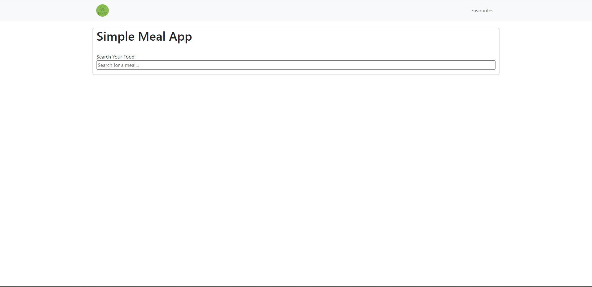
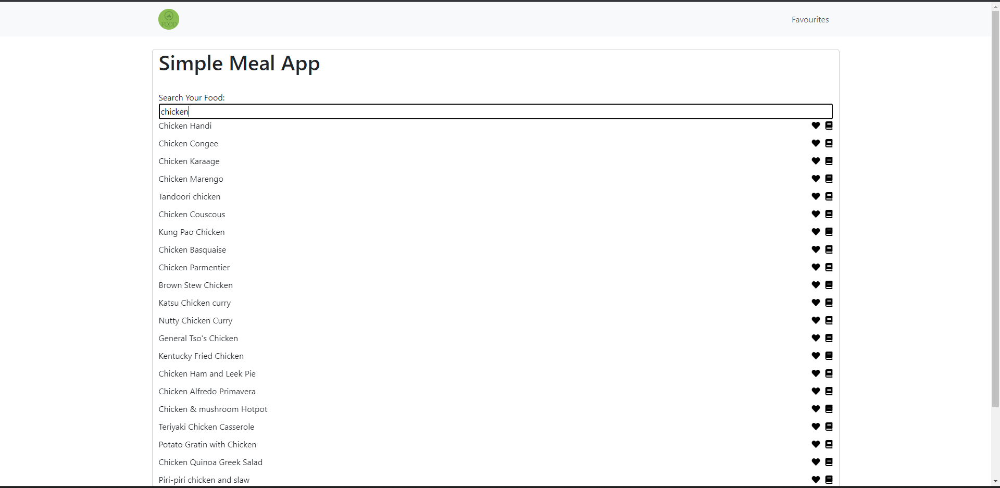
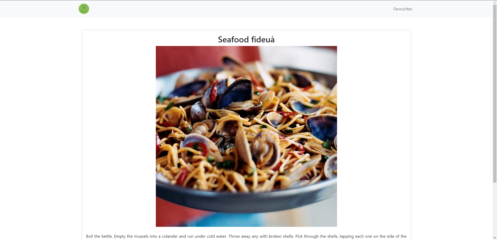
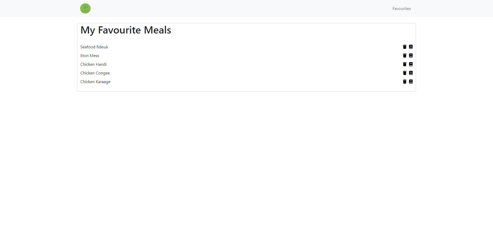

# Meal App

The Meal App is a simple web application that allows users to search for meals, view meal details, and save their favorite meals. It uses the [TheMealDB API](https://www.themealdb.com/api.php) to fetch meal data.

## Features

1. **Home Page**
   - Search for meals by name using the API search endpoint.
   - Display search results in real-time as the user types.
   - Each search result displays a "Add to Favorites" button to save the meal to "My Favourite Meals" list.
   - Clicking on a search result opens a new page with more information about that meal.

2. **Meal Detail Page**
   - Displays detailed information about a selected meal, including its name, photo, and instructions.
   - Users can navigate to this page by clicking on a meal from the search results.

3. **My Favourite Meals Page**
   - Displays a list of all the favorite meals.
   - The list of favorite meals is persistent and remains the same even after closing or refreshing the browser.
   - Each meal in the list has a "Remove from Favorites" button to remove it from the favorites list.

## Technologies Used

- HTML: To structure the web pages.
- CSS: For styling and layout.
- Vanilla JavaScript: To implement the application logic.
- Fetch API: For making asynchronous requests to the TheMealDB API.
- LocalStorage: To store the list of favorite meals persistently in the user's browser.

## How to Use

1. Clone this repository to your local machine.
2. Open the `index.html` file in your web browser to access the Home Page.
3. Type in the search bar to find meals and click on any meal to view more details.
4. To add a meal to the favorites list, click on the "Add to Favorites" button on the search results page.
5. To view the "My Favourite Meals" page, click on the link provided in the navigation or open `my_favourite_meals.html`.
6. On the "My Favourite Meals" page, you can remove meals from the favorites list by clicking on the "Remove from Favorites" button.

## Screenshots

### Home page

### Meal Detail Page

### Favourite Meals Page

## API Credits

TheMealDB API is used in this project. You can find more information about the API and support their service by visiting [TheMealDB website](https://www.themealdb.com/).

## Contributing

This project is for educational purposes, and contributions are not expected. However, if you find any issues or have suggestions for improvements, feel free to open an issue or submit a pull request.

## License

This project is licensed under the MIT License

## Page

URL: [Meal App](https://gokuldevp.github.io/Meal-App/) 
